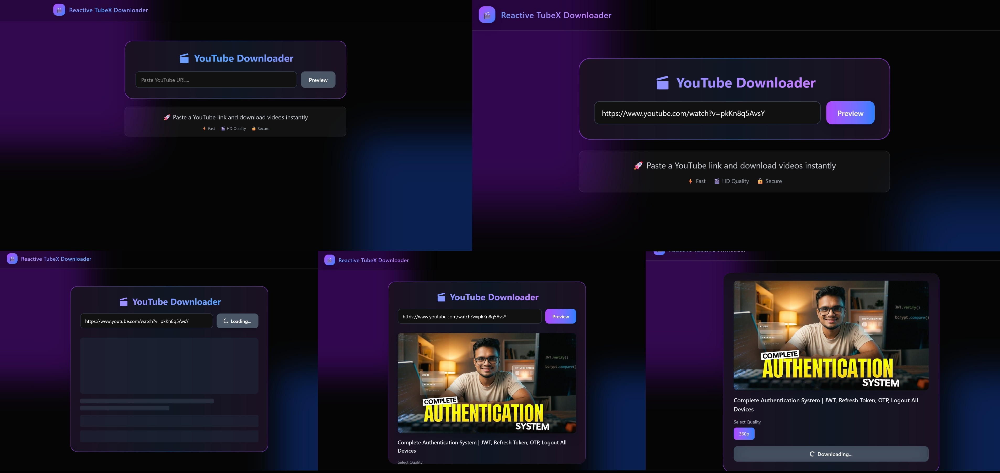

```md
# 🎬 Reactive YouTube Downloader

A modern full-stack YouTube video downloader built using the MERN stack with a clean UI and real-world production handling.

---

## 🚀 Features

- 🎥 Paste YouTube URL and preview video
- 📊 Select video quality (360p, 720p, 1080p)
- ⚡ Streaming-based download (no file storage)
- 🎨 Modern UI with Tailwind CSS
- 🔄 Loading states and skeleton UI
- 🧠 Smart format filtering (no duplicate qualities)
- 📡 Real-time progress handling (Socket.IO based)
- ⚠️ Graceful error handling for restricted videos

---

## 🛠️ Tech Stack

### Frontend
- React (Vite)
- Tailwind CSS
- Axios

### Backend
- Node.js
- Express.js
- yt-dlp (video processing)

---

## 🧠 How It Works

1. User pastes a YouTube URL
2. Backend uses `yt-dlp` to fetch video metadata
3. Available formats are filtered and sent to frontend
4. User selects quality and downloads via streaming

> Uses streaming instead of storing files to improve performance and reduce server load.

---

## 📁 Project Structure

```

reactive-yt-downloader/
│
├── client/          # React frontend
├── server/          # Node.js backend
│   ├── public/      # React build files
│   ├── app.js       # Main server file
│   ├── yt-dlp       # CLI binary (Linux)
│   └── yt-dlp.exe   # CLI binary (Windows - local)

````

---

## ⚙️ Installation & Setup

### 1. Clone Repository

```bash
git clone https://github.com/RajDevWork/reactive-yt-downloader.git
cd reactive-yt-downloader
````

---

### 2. Install Dependencies

```bash
# frontend
cd client
npm install

# backend
cd ../server
npm install
```

---

### 3. Run Locally

```bash
# backend
cd server
node app.js

# frontend
cd client
npm run dev
```

---

## 🚀 Deployment

* Frontend and backend are deployed together as a single service
* React build is served using Express static middleware
* Hosted on Render (backend + frontend combined)

---

## ⚠️ Known Issues

* Some videos may not work due to YouTube bot protection
* Cloud platforms (like Render) may block requests due to shared IP
* Works best locally or on a VPS with a dedicated IP

---

## 💡 Learnings

* Handling CLI tools (yt-dlp) in production environments
* Streaming video data instead of storing files on the server
* Managing third-party API restrictions (YouTube blocking)
* Debugging deployment issues (Linux vs Windows differences)
* Building production-ready UI/UX with Tailwind

---

## 📸 Screenshots



* Home Page
* Video Preview
* Quality Selection
* Download Progress

---

## 🧑‍💻 Author

**Rajeshwar Parihar**

GitHub: [https://github.com/RajDevWork](https://github.com/RajDevWork)

---

## ⭐ Show Your Support

If you like this project, consider giving it a ⭐ on GitHub!

